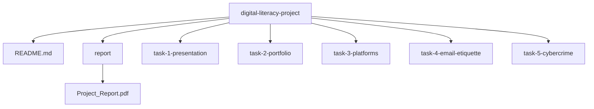

# 📌 Digital Literacy Project – CSE0001

**Name:** Himani sanger  
**Registration Number:** [25BAI11293]  
**Branch:** [B.Tech CSE AI ML]  
**Year:** 1st Year  
**Course Code:** CSE0001  
**Course Title:** Digital Literacy  

---

## 📖 Project Overview

This project was completed as part of the Digital Literacy course, where I took on the role of a **Student Digital Ambassador**. The main aim was to understand and spread awareness about digital literacy among students.

In today’s digital age, it is important not only to use technology but also to use it **safely, responsibly, and professionally**. Through this project, I explored various digital tools and platforms that support both academic learning and professional growth.

The project includes five tasks, each focusing on different aspects of digital literacy such as awareness, online presence, coding platforms, communication skills, and cyber safety.

---

## 🧩 Task Summary

---

### 🔹 Task 1: Digital Literacy Infographic

- Created an awareness infographic using **Canva**
- Covered topics like:
  - Meaning of digital literacy  
  - Safe internet practices  
  - Professional online presence  
- Focused on clarity, simplicity, and visual appeal  

📁 **Folder:** `task-1-presentation/`

---

### 🔹 Task 2: Digital Portfolio

- Created/updated profiles on:
  - GitHub  
  - LinkedIn  
  - Other platforms (if any)  
- Developed a professional online identity  
- Included profile screenshots  

📁 **Folder:** `task-2-portfolio/`

---

### 🔹 Task 3: Platforms Exploration

#### 💻 Part A: Coding
- Solved a beginner-level problem on platforms like HackerRank  

#### 📊 Part B: Google Form
- Created a Digital Literacy Awareness Quiz  
- Connected responses to Google Sheets  
- 🔗 [View Form](https://docs.google.com/forms/d/e/1FAIpQLSeBIbdPrj6zt60gnV5suZglUZGrk1GwYAkAaPe39P1P2P4LGA/viewform?usp=publish-editor)

📁 **Folder:** `task-3-platforms/`

---

### 🔹 Task 4: Email Etiquette

- Wrote two formal emails:
  - Assignment extension request  
  - Internship application  
- Designed a **Social Media Do’s & Don’ts Checklist**  

📁 **Folder:** `task-4-email-etiquette/`

---

### 🔹 Task 5: Cybercrime Awareness

- Studied cybercrime (UPI & online fraud)
- Created:
  - Case study  
  - Prevention checklist  
- Included:
  - National Cyber Crime Portal  
  - Helpline: **1930**  

📁 **Folder:** `task-5-cybercrime/`

---

## 🛠️ Tools & Technologies

- 🐍 Python 3.x  
- 📚 Libraries: `random`, `time`  
- 🎨 Canva  
- 💻 GitHub  
- 🔗 LinkedIn  
- 👨‍💻 HackerRank / CodeChef  
- 📊 Google Forms & Sheets  

---

## 📂 Repository Structure

## 🎯 Key Learnings

- ✔️ Understood the importance of digital literacy  
- ✔️ Built a professional online presence  
- ✔️ Improved communication and email writing  
- ✔️ Learned about cyber threats and prevention  
- ✔️ Practiced responsible digital behavior  

---

## 🔐 Cyber Safety Note

> ⚠️ Always stay alert while using digital platforms

- Do not share OTPs or passwords  
- Verify links before clicking  
- Report fraud: https://cybercrime.gov.in  
- Helpline: **1930**  

---

## 📌 Conclusion

This project was really a great experience for me. It helped me improve my technical skills, communication, and understanding of digital safety. While working on it, I learned how to use technology in a better and more responsible way. I also became more confident in expressing my ideas clearly and using different digital tools.

I also realized how important it is to stay safe online and behave responsibly in the digital world. This project not only increased my confidence but also prepared me to use technology in a smarter and safer way. I believe these skills will help me in my studies and will also be useful for my future career.

